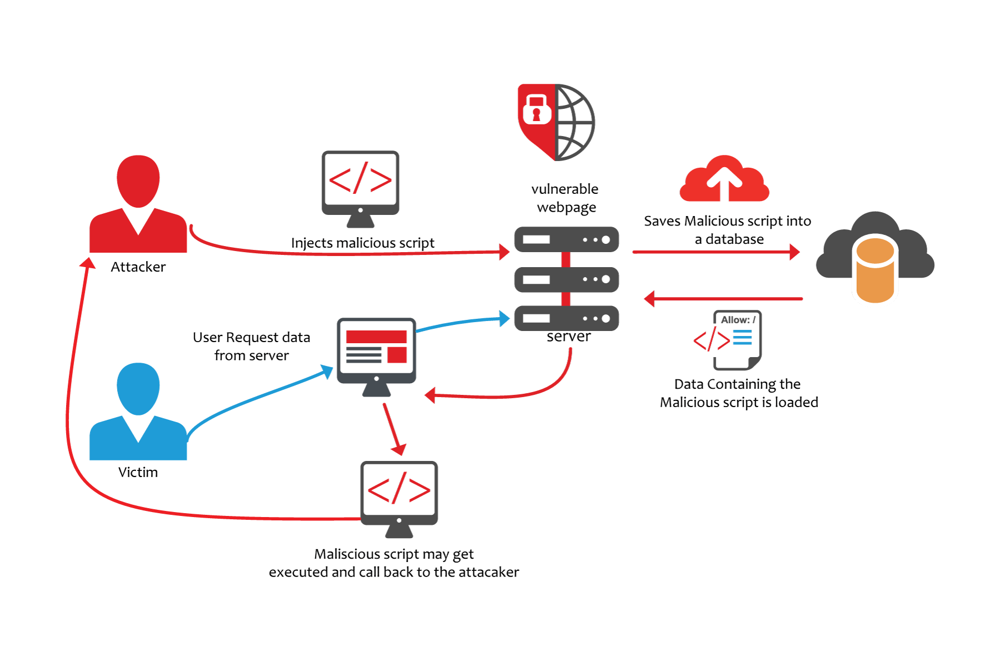

# Top 10 lỗ hổng bảo mật web phổ biến theo chuẩn OWASP – OWASP TOP 10

Lỗ hổng bảo mật luôn là vấn đề đau đầu của các quản trị viên website. Những lỗ hổng này cho phép tin tặc khai thác – tấn công – xâm nhập – vi phạm dữ liệu của website doanh nghiệp. Dưới đây là TOP 10 lỗ hổng bảo mật web phổ biến nhất theo tiêu chuẩn OWASP, hay còn được biết đến với cái tên OWASP TOP 10.

>OWASP là một tiêu chuẩn toàn cầu để phục vụ việc kiểm thử xâm nhập – Penetration Testing (Pentest) được dễ dàng hơn. Tiêu chuẩn này được đề xuất bởi một tổ chức phi lợi nhuận: Open Web Application Security Project (OWASP).
>Tiêu chuẩn OWASP giúp cho các chuyên gia kiểm thử (pentester) kiểm tra bảo mật cho website một cách chi tiết, hiệu quả.

## 1. Lỗ hổng Injection (Lỗi chèn mã độc)

Injection là lỗ hổng xảy ra do sự thiếu sót trong việc lọc các dữ liệu đầu vào không đáng tin cậy. Khi bạn truyền các dữ liệu chưa được lọc tới Database (Ví dụ như lỗ hổng SQL injection), tới trình duyệt (lỗ hổng XSS), tới máy chủ LDAP (lỗ hổng LDAP Injection) hoặc tới bất cứ vị trí nào khác. Vấn đề là kẻ tấn công có thể chèn các đoạn mã độc để gây ra lộ lọt dữ liệu và chiếm quyền kiểm soát trình duyệt của khách hàng.

Mọi thông tin mà ứng dụng của bạn nhận được đều phải được lọc theo Whitelist. Bởi nếu bạn sử dụng Blacklist việc lọc thông tin sẽ rất dễ bị vượt qua (Bypass). Tính năng Pattern matching sẽ không hoạt động nếu thiết lập Blacklist.

### Cách ngăn chặn lỗ hổng:

Để chống lại lỗ hổng này chỉ “đơn giản” là vấn đề bạn đã lọc đầu vào đúng cách chưa hay việc bạn cân nhắc  liệu một đầu vào có thể được tin cậy hay không. Về căn bản, tất cả các đầu vào đều phải được lọc và kiểm tra trừ trường hợp đầu vào đó chắc chắn đáng tin cậy.(Tuy nhiên việc cẩn thận kiểm tra tất cả các đầu vào là luôn luôn cần thiết).

Ví dụ, trong một hệ thống với 1000 đầu vào, lọc thành công 999 đầu vào là không đủ vì điều này vẫn để lại một phần giống như “gót chân Asin”, có thể phá hoại hệ thống của bạn bất cứ lúc nào. Bạn có thể cho rằng đưa kết quả truy vấn SQL vào truy vấn khác là một ý tưởng hay vì cơ sở dữ liệu là đáng tin cậy. Nhưng thật không may vì đầu vào có thể gián tiếp đến từ những kẻ có ý đồ xấu. Đây được gọi là lỗi Second Order SQL Injection.

Việc lọc dữ liệu khá khó vì thế các bạn nên sử dụng các chức năng lọc có sẵn trong framework của mình. Các tính năng này đã được chứng minh sẽ thực hiện việc kiểm tra một cách kỹ lưỡng. Bạn nên cân nhắc sử dụng các framework vì đây là một trong các cách hiệu quả để bảo vệ máy chủ của bạn.

## 2. Broken Authentication

Đây là nhóm các vấn đề có thể xảy ra trong quá trình xác thực. Có một lời khuyên là không nên tự phát triển các giải pháp mã hóa vì rất khó có thể làm được chính xác.

Có rất nhiều rủi ro có thể gặp phải trong quá trình xác thực:

* URL có thể chứa Session ID và rò rỉ nó trong Referer Header của người dùng khác.
* Mật khẩu không được mã hóa hoặc dễ giải mã trong khi lưu trữ.
* Lỗ hổng Session Fixation.
* Tấn công Session Hijacking có thể xảy ra khi thời gian hét hạn của session không được triển khai đúng hoặc sử dụng HTTP (không bảo mật SSL)…
* …

### Cách ngăn chặn lỗ hổng:

Cách đơn giản nhất để tránh lỗ hổng bảo mật web này là sử dụng một framework. Trong trường hợp bạn muốn tự tạo ra bộ xác thực hoặc mã hóa cho riêng mình, hãy nghĩ đến những rủi ro mà bạn sẽ gặp phải và tự cân nhắc kĩ trước khi thực hiện.

## 3. Lỗ hổng XSS (Cross Site Scripting)


Lỗ hổng XSS (Cross-scite Scripting) là một lỗ hổng rất phổ biến. Kẻ tấn công chèn các đoạn mã JavaScript vào ứng dụng web. Khi đầu vào này không được lọc, chúng sẽ được thực thi mã độc trên trình duyệt của người dùng. Kẻ tấn công có thể lấy được cookie của người dùng trên hệ thông hoặc lừa người dùng đến các trang web độc hại.

### Cách ngăn chặn lỗ hổng:
Có một cách bảo mật web đơn giản đó là không trả lại thẻ HTML cho người dùng. Điều này còn giúp chống lại HTML Injection – Một cuộc tấn công tương tự mà hacker tấn công vào nội dung HTML – không gây ảnh hưởng nghiêm trọng nhưng khá rắc rối cho người dùng. Thông thường cách giải quyết đơn giản chỉ là Encode (chuyển đổi vê dạng dữ liệu khác) tất cả các thẻ HTML. Ví dụ thẻ <script> được trả về dưới dạng <script&gt.

## 4. Insecure Direct Object References

Đây là trường hợp điển hình của việc cho rằng đầu vào của người dùng là tin cậy từ đó dẫn đến lỗ hổng bảo mật. Lỗ hổng này xảy ra khi chương trình cho phép người dùng truy cập các tài nguyên (dữ liệu, file, database). Nếu không thực hiện quá trình kiểm soát quyền hạn (hoặc quá trình này không hoàn chỉnh) kẻ tấn công có thể truy cập một cách bất hợp pháp vào các dữ liệu nhạy cảm, quan trọng trên máy chủ.

Chúng ta có thể xem xét ví dụ sau:

Một đoạn mã có module download.php và cho phép người dùng tải tệp xuống sử dụng tham số CGI. Ví dụ download.php?file=something.txt. Do sai sót của nhà phát triển, việc kiểm tra quyền hạn đã bị bỏ qua. Kẻ tấn công có thể sử dụng lỗ hổng này để tải về bất kì tệp nào trên hệ thống mà ứng dụng có quyền truy cập. Chẳng hạn như code ứng dụng, hoặc các dữ liệu khác trên máy chủ.

Một ví dụ phổ biến khác là chức năng đặt lại mật khẩu dựa vào đầu vào của người dùng để xác định mật khẩu đặt lại. Sau khi nhấp vào URL hợp lệ, kẻ tấn công có thể sửa đổi trường tên người dùng trong URL để “đóng giả” admin.

### Cách ngăn chặn lỗ hổng
Thực hiện phân quyền người dùng đúng cách và nhất quán với sự áp dụng triệt để các Whitelist.

## 5. Security Misconfiguration

Trong thực tế, máy chủ website và các ứng dụng đa số bị cấu hình sai. Có lẽ do một vài sai sót như:

* Chạy ứng dụng khi chế độ debug được bật.
* Directory listing
* Sử dụng phần mềm lỗi thời (WordPress plugin, PhpMyAdmin cũ)
* Cài đặt các dịch vụ không cần thiết.
* Không thay đổi default key hoặc mật khẩu
* Trả về lỗi xử lý thông tin cho kẻ tấn công lợi dụng để tấn công, chẳng hạn như stack traces.

### Cách ngăn chặn lỗ hổng:
Có một quá trình “xây dựng và triển khai” tốt (tốt nhất là tự động). Cần một quá trình audit các chính xác bảo mật trên máy chủ trước khi triển khai.

## 6. Sensitive data exposure (Rò rỉ dữ liệu nhạy cảm)

Lỗ hổng này thuộc về khía cạnh crypto và tài nguyên. Dữ liệu nhạy cảm phải được mã hóa mọi lúc, bao gồm cả khi gửi đi và khi lưu trữ – không được phép có ngoại lệ. Thông tin thẻ tín dụng và mật khẩu người dùng không bao giờ được gửi đi hoặc được lưu trữ không được mã hóa. Rõ ràng thuật toán mã hóa và hashing không phải là một cách bảo mật yếu. Ngoài ra, các tiêu chuẩn an ninh web đề nghị sử dụng AES (256 bit trở lên) và RSA (2048 bit trở lên).

Cần phải nói rằng các Session ID và dữ liệu nhạy cảm không nên được truyền trong các URL và cookie nhạy cảm nên có cờ an toàn.

### Cách ngăn chặn lỗ hổng

* Sử dụng HTTPS có chứng chỉ phù hợp và PFS (Perfect Forward Secrecy). Không nhận bất cứ thông tin gì trên các kết nối không phải là HTTPS. Có cờ an toàn trên cookie.
* Bạn cần hạn chế các dữ liệu nhạy cảm có khả năng bị lộ của mình. Nếu bạn không cần những dữ liệu nhạy cảm này, hãy hủy nó. Dữ liệu bạn không có không thể bị đánh cắp.
* Không bao giờ lưu trữ thông tin thẻ tín dụng, nếu không muốn phải đối phó với việc tuân thủ PCI. Hãy đăng ký một bộ xử lý thanh toán như Stripe hoặc Braintree.
* Nếu bạn có dữ liệu nhạy cảm mà bạn thực sự cần, lưu trữ mã hóa nó và đảm bảo rằng tất cả các mật khẩu được sử dụng hàm Hash để bảo vệ. Đối với Hash, nên sử dụng bcrypt. Nếu bạn không sử dụng mã hoá bcrypt, hãy tìm hiểu về mã Salt để ngăn ngừa rainbow table attack.

Không lưu trữ các khóa mã hóa bên cạnh dữ liệu được bảo vệ. Việc này giống như khóa xe mà cắm chìa luôn ở đó. Bảo vệ bản sao lưu của bạn bằng mã hóa và đảm bảo các khóa của bạn là riêng tư.

## 7. Missing function level access control (lỗi phân quyền)

Đây chỉ là sai sót trong vấn đề phân quyền. Nó có nghĩa là khi một hàm được gọi trên máy chủ, quá trình phân quyền không chính xác. Các nhà phát triển dựa vào thực tế là phía máy chủ tạo ra giao diện người dùng và họ nghĩ rằng khách hàng không thể truy cập các chức năng nếu không được cung cấp bởi máy chủ.

Tuy nhiên, kẻ tấn công luôn có thể yêu cầu các chức năng “ẩn” và sẽ không bị cản trở bởi việc giao diện người dùng không cho phép thực hiện các chức năng này. Hãy tưởng tượng trong giao diện người dùng chỉ có bảng điều khiển/admin và nút nếu người dùng thực sự là quản trị viên. Không có gì ngăn cản kẻ tấn công phát hiện ra những tính năng này và lạm dụng nó nếu không phân quyền.

### Cách ngăn chặn lỗ hổng

## 8. Cross Site Request Forgery (CSRF)

Đây là một ví dụ của cuộc tấn công deputy attack. Trình duyệt bị đánh lừa bởi một số bên thứ ba lạm dụng quyền hạn. 
Ví dụ: trang web của bên thứ ba gửi yêu cầu đến trang web đích (ví dụ: ngân hàng của bạn) sử dụng trình duyệt của bạn với các dữ liệu như cookie và phiên người dùng. Nếu bạn đang đăng nhập vào một trang trên trang chủ của ngân hàng và trang đó dễ bị tấn công, một tab khác có thể cho phép kẻ tấn công đóng giả người quản trị. Deputy là khi trang web lạm dụng quyền hạn của mình (session cookies) để làm điều gì đó mà kẻ tấn công yêu cầu.

### Chúng ta có thể xem xét ví dụ sau

* Kẻ tấn công là Alice chọn mục tiêu là chiếc ví của Todd bằng cách chuyển một phần tiền của Todd cho cô ta. Ngân hàng của Todd đã gặp phải lỗ hổng CSRF. Để gửi tiền, Todd phải truy cập vào URL sau:

 

* Sau khi URL này được mở ra, một trang thành công được trình bày cho Todd và việc chuyển đổi đã hoàn tất. Alice cũng biết rằng Todd thường ghé thăm một trang web dưới quyền kiểm soát của cô tại blog.aliceisawesome.com, nơi cô đặt đoạn mã sau đây:

```

```

* Khi truy cập trang web của Alice, trình duyệt của Todd nghĩ rằng Alice liên kết đến một hình ảnh và tự động đưa ra yêu cầu HTTP GET để lấy “hình ảnh”, nhưng điều này thực sự hướng dẫn ngân hàng của Todd chuyển $1500 đến Alice.

### Cách ngăn chặn lỗ hổng

Lưu trữ một Token bí mật trong một trường form ẩn mà không thể truy cập được từ trang web của bên thứ ba. Tất nhiên bạn phải xác minh trường ẩn này. Một số trang web yêu cầu mật khẩu của bạn cũng như khi sửa đổi các cài đặt nhạy cảm.

 Ở phía máy chủ, phải luôn được phân quyền một cách triệt để từ khâu thiết kế. Không có ngoại lệ – mọi lỗ hổng sẽ dẫn đến đủ các vấn đề nghiêm trọng.
 
## 9. Using component with known vulnerabilities

Đây là vấn đề xảy ra khi sử dụng các bộ thư viện đã tồn tại lỗ hổng. Trước khi tích hợp một mã nguồn mới vào website, hãy thực hiện một số nghiên cứu hoặc kiểm tra bảo mật. Sử dụng mã nguồn mà bạn nhận được từ một người ngẫu nhiên trên GitHub hoặc một số diễn đàn có thể rất thuận tiện. Nhưng hãy sẵn sàng trước nguy cơ đối diện với một lỗ hổng bảo mật web nghiêm trọng.

Ví dụ: Nhiều trường hợp, trang admin bị lộ không phải vì các lập trình viên sai sót, mà vì phần mềm của bên thứ ba vẫn chưa được cập nhật. Nếu bạn nghĩ rằng họ sẽ không tìm thấy cài đặt phpmyadmin ẩn của bạn, hãy tìm hiểu về dirbuster.

### Cách ngăn chặn lỗ hổng:

Chú ý cẩn thận khi sử dụng các thành phần của bên thứ 3, không nên là một coder copy-paste. Kiểm tra cẩn thận các đoạn code quan trọng của bạn. Nếu các đoạn code này có lỗ hổng, tin tặc có thể đọc cơ sở dữ liệu, tệp tin cấu hình, mật khẩu… của bạn.

* Cập nhật mọi thứ: Đảm bảo bạn đang sử dụng phiên bản mới nhất của tất cả mọi thứ và có kế hoạch cập nhật chúng thường xuyên. Ít nhất là đăng ký bản tin về các lỗ hổng bảo mật mới liên quan đến sản phẩm.

## 10. Unvalidated redirects and forwards

Đây lại là vấn đề về lọc đầu vào. Giả sử rằng trang đích có một mô-đun redirect.php lấy URL làm tham số. Thao tác với tham số này có thể tạo ra một URL trên targetite.com chuyển hướng trình duyệt đến địa chỉ malwareinstall.com. Khi người dùng nhìn thấy liên kết, họ sẽ thấy liên kết targetite.com/blahblahblah tin cậy và truy cập vào. Họ ít biết rằng địa chỉ này thực ra chuyển tới trang nhúng phần mềm độc hại (hoặc bất kỳ trang độc hại khác). Ngoài ra, kẻ tấn công có thể chuyển hướng trình duyệt sang targetite.com/deleteprofile?confirm=1.

### Cách ngăn chặn lỗ hổng:

* Không sử dụng chức năng chuyển hướng.
* Có một danh sách tĩnh các vị trí hợp lệ để chuyển hướng đến.
* Có Whitelist tham số người dùng xác định.