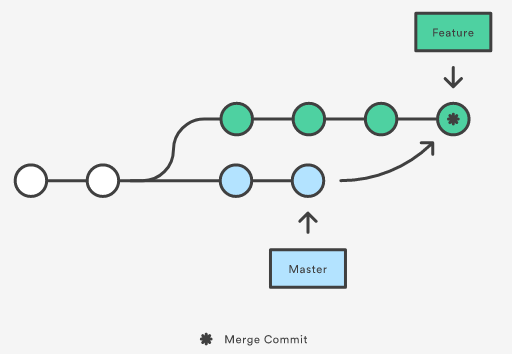

# Cơ bản
## 1. Git là gì? Những lợi ích của việc dùng Git?
### Git là gì?
`Git` là tên gọi của một `Hệ thống quản lý phiên bản phân tán` (`Distributed Version Control System – DVCS`) là một trong những hệ thống quản lý phiên bản phân tán phổ biến nhất hiện nay.

`DVCS` giúp mỗi PC có thể `lưu trữ` nhiều `phiên bản khác nhau` của 1 bộ mã nguồn đã được nhân bản (`clone`) từ một kho chứa mã nguồn (`repository`), các thay đổi trên mã nguồn sẽ được `commit` rồi đưa lên server nơi đặt kho chứa chính. Các PC khác (có quyền truy cập) cũng có thể `clone` lại mã nguồn từ kho chứa để lấy phiên bản mới nhất. Trong Git, khái niệm này gọi là `Working Tree`.


`Git` ưu việt hơn các hệ thống quản lý code thông thường vì có `khả năng tách nhánh` (branch), hỗ trợ rất tốt cho teamwork, vì những việc như phân chia task, tổng hợp code trở nên dễ dàng hơn nhiều.

### Mô hình tổng quan


### Điểm giống và khác giữa git và các hệ thống quản lý code
#### 1. Giống:
- Git là một hệ thống quản lý phiên bản (viết tắt: VCS), hỗ trợ:
 - Quản lý code và lịch sử thay đổi.
 VD: Cập nhật code, chỉnh sửa code nhanh hơn, theo dõi các thay đổi thuận tiện, dễ dàng quay lại phiên bản cũ nếu xuất hiện lỗi
 - Làm việc nhóm.
 VD: Làm việc nhóm trở nên đơn giản hơn khi sử dụng nhưng tính năng như `branch`

#### 2. Khác:
- Git tiếp cận theo hướng `phân tán` (distributed approach)
- Điểm khác biệt lớn nhất là khả năng tách nhánh (branch).

 => Git hỗ trợ rất tốt cho teamwork, vì những việc như phân chia task, tổng hợp code trở nên dễ dàng hơn nhiều. (tìm hiểu them "git flow")

### Lợi ích của Git
- Sắp xếp công việc tốt hơn.
  Có thể tập trung giải quyết từng task mà không phải bận tâm lo lắng cho những task liên quan.
- Linh hoạt hơn khi phải làm cùng lúc nhiều task , bởi cấu trúc phân tán git.
- Tự tin hơn khi thử nghiệm những ý tưởng mới, vì có thể tách biệt việc thử nghiệm với dự án chính. Điều này giúp nâng cao chất lượng code cũng như tính sáng tạo.

## 2. Các thuật ngữ trong git
### Kho Repo (Repository)
`Repository` hay được gọi tắt là `Repo`, đơn giản là nơi `chứa` tất cả những `thông tin` cần thiết để `duy trì` và `quản lý` các `sửa đổi` và `lịch sử` của toàn bộ `project`.

Repo có 2 cấu trúc dữ liệu chính:

* Object Store
* Index.

> Tất cả dữ liệu của Repo đèu được chứa trong thư mục bạn đang làm việc dưới dạng folder ẩn có tên là .git


## Working Tree và Index

Thư mục được đặt trong sự quản lý của Git mà mọi người đang thực hiện công việc trong thực tế được gọi là working tree.

Và trên Git, giữa repository và working tree tồn tại một nơi gọi là index. Index là nơi để chuẩn bị cho việc commit lên repository.


## Remote repository và local repository
Git được phân thành 2 loại là remote repository và local repository:

- Remote repository: Là repository để chia sẻ giữa nhiều người và bố trí trên server chuyên dụng.
- Local repository: Là repository bố trí trên máy của bản thân mình, dành cho một người dùng sử dụng


## Nhánh (Branch)
> Tính năng nổi bật của git là nhánh.

Với git, việc quản lý nhánh rất dễ dàng. Mỗi nhánh trong Git gần giống như một workspace. Việc nhảy vào một nhánh để làm việc trong đó tương tự việc chuyển qua ngữ cảnh làm việc mới, và sau đó có thể nhanh chóng quay lại ngữ cảnh cũ.

> Nhánh master là nhánh “mặc định” khi bạn tạo một repository. Thông thường là nhánh chính của ứng dụng.


## Trộn (Merge)
Trộn source từ một nhánh khác vào nhánh hiện tại.


Lưu ý:

- Kiểm tra branch hiện đang làm việc trước khi merge
- Phải đẩy tất cả những thay đổi dưới máy local lên Git trước khi merge
- Trước khi merge phải lấy hết những thay đổi mới nhất của các branch khác, - hay ít nhất là branch cần merge về máy
- Merge thành công thì nên đẩy source lên lại lên server
- Nên merge bằng GUI tool.

## Xung đột (Conflict)
`Conflic` là trường hợp có 2 sự thay đổi trong một dòng code và máy tính không thể tự quyết định dòng code nào là “đúng”.

> Đúng ở đây có nghĩa là “ý đồ của lập trình viên”.

Để giải quyết mâu thuẫn bạn phải dùng “tay không” để sữa các xung đột này. Bạn chỉ việc nhìn vào file bị conflict và tự quyết định dòng code nào giữ lại, dòng nào xóa bỏ.


## Commit
Thao tác ghi lại việc thêm/thay đổi file hay thư mục vào repository thì sẽ thực hiện thao tác gọi là `Commit`.

Khi thực hiện commit, trong repository sẽ tạo ra commit (hoặc revision) đã ghi lại sự khác biệt từ trạng thái đã commit lần trước với trạng thái hiện tại.

Commit này đang được chứa tại repository, các commit nối tiếp với nhau theo thứ tự thời gian. Bằng việc lần theo commit này từ trạng thái mới nhất thì có thể biết được lịch sử thay đổi trong quá khứ hoặc nội dung thay đổi đó.


## Git Remote
Ứng dụng trong trường hợp làm việc với nhiều repo cùng 1 thời điểm

Trên thực tế khi làm việc với nhau thì không như vậy, vì không phải máy ai cũng cài một “git server” để người khác kết nối được với mình. Thông thường thì chúng ta sẽ sử dụng một repo chung và các máy kết nối vào repo đó.

VD: 1 repo được lưu trên cả github.com và bitbucket.org. => repo có 2 remote github và bitbucket
# Thực hành
## 1. Sử dụng Git cơ bản
### 1. Cài đặt Git
#### 1.1 Cài đặt Git trên Ubuntu

```
apt-get install git -y
```

#### 1.2 Cài đặt trên CentOS/RHEL

```
yum install git -y
```

### 2. Thiết lập chứng thực cá nhân
#### 2.1 Cấu hình thiết lập tên, Email

```
git config --global user.name "thanhba"
git config --global user.email "thanh@gmail.com"
```

#### 2.2 Tự lưu passwd Github Repo sau commit đầu

```
git config --global credential.helper cache
```

#### 2.3 Kiểm tra kết quả

```
lacoski@lacoski-PC:~$ cat ~/.gitconfig
[user]
	email = thanh@gmail.com
	name = thanhba
[credential]
	helper = cache

lacoski@lacoski-PC:~$ git config --list
user.email=thanh@gmail.com
user.name=thanhba
credential.helper=cache
```

### 3. Thiết lập repository

> Repository (kho chứa) là nơi lưu trữ mã nguồn và người khác có thể sao chép (clone) lại mã nguồn để làm việc.

__Repository có hai loại:__
- Local Repository (Kho chứa trên máy cá nhân)
- Remote Repository (Kho chứa trên một máy chủ từ xa).

#### 3.1 Tạo Local Repository

__Bước 1: Truy cập thư mục lưu các Git Repo__

```
cd [đường dẫn]
```
__Bước 2: Tạo Repo local__

```
git init [tên repo]
```
VD:
```
$ git init git_example
Initialized empty Git repository in /home/lacoski/git_example/.git/
```

> Truy cập git repo vừa tạo sẽ thấy thư mục `.git`.

> '.git' là thư mục ẩn chứa các thiết lập về Git cũng như lưu lại toàn bộ thông tin về kho chứa


#### 3.2 Tạo Remote Repository

> Sử dụng Github làm repo remote, truy cập chia sẻ từ xa

> Cách tạo tự tìm hiểu theo giao diện Git cung cấp

__Để clone repo từ xa__
```
git clone [repo link]
```
> Mỗi khi tạo 1 Repo trên Linux sẽ nhận được 1 Repo link riêng


__Commit và update Remote Repo__

```shell
lacoski@lacoski-PC:~/GitRepo/tim-hieu-git$ git add .

lacoski@lacoski-PC:~/GitRepo/tim-hieu-git$ git commit -m "init repo"
[master 9ec710b] update
 3 files changed, 8 insertions(+)
 create mode 100644 docs/git-remote-repo-origin.md
 create mode 100644 images/git-clone-1.png

lacoski@lacoski-PC:~/GitRepo/tim-hieu-git$ git push origin master
Counting objects: 7, done.
Delta compression using up to 4 threads.
Compressing objects: 100% (6/6), done.
Writing objects: 100% (7/7), 19.70 KiB | 0 bytes/s, done.
Total 7 (delta 3), reused 0 (delta 0)
remote: Resolving deltas: 100% (3/3), completed with 3 local objects.
To https://github.com/lacoski/tim-hieu-git.git
   dd95116..9ec710b  master -> master
```

## 2. Git commit và staging area
### Cơ bản Staging Area

__Staging Area__ là khu vực chuẩn bị cho quá trình commit.

Với Hệ thống quản lý phiên bản (Version Control System) quản lý dữ liệu tại 2 nơi:

- Thư mục đang làm việc trên máy tính (working tree)
- Kho chứa mã nguồn (repository) (ví dụ như kho chứa trên Github).

Git bổ sung thêm một lựa chọn:

- Khu vực trung gian gọi là Staging Area
> Đây là 1 đặc điểm chính của Git

`Staging Area` là khu vực lưu trữ những thay đổi trên tập tin so sánh giữa repo chính và repo clone trước `commit`

Khi `commit` tập tin thì tập tin đó phải nằm trong Staging Area. Một tập tin khi nằm trong Staging Area sẽ có trạng thái là Stagged (xem thêm ở dưới).


Để đưa file vào Staging Area, sử dụng lệnh:

```
git add [tên_file]
```

### Cơ bản về Commnit, cách hoạt động
`Commit` là chỉ thị trên Git, lưu lại bản chụp (snapshot) các sự thay đổi trong thư mục làm việc, và các tập tin và thư mục được thay đổi đã phải nằm trong Staging Area.

Mỗi `commit` sẽ được lưu lại lịch sử chỉnh sửa của mã nguồn kèm theo tên và địa chỉ email của người commit.

Ngoài ra Git cho phép khôi phục lại tập tin trong lịch sử commit, cho phép phân nhánh (branch).

__Chỉ thị commit__

```
git commit -m [Lời nhắn]
```

### Trạng thái chỉ thị Commit

__Git có hai loại trạng thái chính:__

- Tracked – Là tập tin đã được đánh dấu theo dõi trong Git.
 Trạng thái Tracked sẽ có thêm các trạng thái:
 - Unmodified (chưa chỉnh sửa gì)
 - Modified (đã chỉnh sửa)
 - Staged (đã sẵn sàng để commit).

- Untracked – Là tập tin không muốn làm việc với nó trong Git.


__Untracked__

Xuất hiện khi tạo mới hoặc thêm vào một tập tin mới vào trong thư mục repo đang làm việc. Nó sẽ ở trạng thái Untracked.

VD:

```shell
lacoski@lacoski-PC:~/GitTest/example$ touch test.txt
lacoski@lacoski-PC:~/GitTest/example$ git status
On branch master

Initial commit

Untracked files:
  (use "git add <file>..." to include in what will be committed)

	test.txt

nothing added to commit but untracked files present (use "git add" to track)

```

Chuyển tập tin Untracked => Untracked

```shell
lacoski@lacoski-PC:~/GitTest/example$ git add test.txt
lacoski@lacoski-PC:~/GitTest/example$ git status
On branch master

Initial commit

Changes to be committed:
  (use "git rm --cached <file>..." to unstage)

	new file:   test.txt
```

__Tracked__

Tập tin đã được đưa về Tracked thì nó sẽ có thêm 3 trạng thái:

- Modified
- Unmodified
- Staged

VD:

```shell
lacoski@lacoski-PC:~/GitTest/example$ echo "test" > test.txt
lacoski@lacoski-PC:~/GitTest/example$ git status
On branch master

Initial commit

Changes to be committed:
  (use "git rm --cached <file>..." to unstage)

	new file:   test.txt

Changes not staged for commit:
  (use "git add <file>..." to update what will be committed)
  (use "git checkout -- <file>..." to discard changes in working directory)

	modified:   test.txt
```

__Bỏ qua trạng thái Staging Aree:__

```
git commit -a -m [Skipped Staging Are to commit]
```
> `Commit` tập tin đã được Tracked mà không cần đưa nó vào Staging Area

VD:

```shell
lacoski@lacoski-PC:~/GitTest/example$ git status
On branch master
Changes not staged for commit:
  (use "git add <file>..." to update what will be committed)
  (use "git checkout -- <file>..." to discard changes in working directory)

	modified:   test.txt

no changes added to commit (use "git add" and/or "git commit -a")

lacoski@lacoski-PC:~/GitTest/example$ git commit -a -m "demo"
[master 9c002a6] demo
 1 file changed, 1 insertion(+)

lacoski@lacoski-PC:~/GitTest/example$ git status
On branch master
nothing to commit, working directory clean
```
## 3. Phân biệt git fetch vs git pull
### Git fetch

Thao tác `fetch` kiểm tra các thay đổi mã nguồn trên remote repository
> Fetch không cập nhật các thay đổi mới vào mã nguồn hiện tại.

Fetch được xem là phương pháp kiểm tra thay đổi trên remote repository.


## Git pull
Sử dụng để update lại branch hiện tại với các thay đổi mới trên remote repository.

Khi thực hiện pull, thao merge sẽ tự động diễn ra, update nội dung của remote repository tới mã nguồn local

__Trước khi pull__


__Sau khi pull__


## Mô hình tổng quan so sánh git fetch vs git pull


## 4. Git log và undo
### Xem lịch sử với git log
__Xem lịch sử commit:__

```shell
lacoski@lacoski-PC:~/GitTest/example$ git log
commit 9c002a6352b11e6873cdb7bd4cff768ba7b96674
Author: thanh1996 <123xuzu@gmail.com>
Date:   Mon Mar 26 11:35:39 2018 +0700

    demo

commit 8fcb6a81e33bf0f2162d8547a2baf6d7415d6d4d
Author: thanh1996 <123xuzu@gmail.com>
Date:   Mon Mar 26 11:35:06 2018 +0700

    demo
```

> Mỗi 1 trường sẽ có check sum riêng, thời gian commit

__Xem lịch sử commit chi tiết__

```
lacoski@lacoski-PC:~/GitTest/example$ git log -p
commit 9c002a6352b11e6873cdb7bd4cff768ba7b96674
Author: thanh1996 <123xuzu@gmail.com>
Date:   Mon Mar 26 11:35:39 2018 +0700

    demo

diff --git a/test.txt b/test.txt
index e69de29..9daeafb 100644
--- a/test.txt
+++ b/test.txt
@@ -0,0 +1 @@
+test

commit 8fcb6a81e33bf0f2162d8547a2baf6d7415d6d4d
Author: thanh1996 <123xuzu@gmail.com>
Date:   Mon Mar 26 11:35:06 2018 +0700

    demo

diff --git a/test.txt b/test.txt
new file mode 100644
index 0000000..e69de29
```

### Các thủ thuật
__Thiết lập log dễ nhìn hơn__

```shell
lacoski@lacoski-PC:~$ git config --global alias.lg "log --color --graph --pretty=format:'%Cred%h%Creset -%C(yellow)%d%Creset %s %Cgreen(%cr) %C(bold blue)<%an>%Creset' --abbrev-commit"
```

__Kết quả__

```shell
lacoski@lacoski-PC:~/GitRepo/tim-hieu-git$ git log
* 28b545d - (HEAD -> master, origin/master) git thao tac repo (33 minutes ago) <thanh1996>
* 7bf0545 - git thao tac repo (35 minutes ago) <thanh1996>
* 881c0ce - update (66 minutes ago) <thanh1996>
* 9ec710b - update (68 minutes ago) <thanh1996>
* dd95116 - docs (3 hours ago) <thanh1996>
* 4b2a004 - update (3 hours ago) <thanh1996>
* ba6963f - update (3 hours ago) <thanh1996>
* c460a31 - git commit staging area (3 hours ago) <thanh1996>
* 31be675 - git basic (4 hours ago) <thanh1996>
* dd0777c - update (4 hours ago) <thanh1996>
* c84b70c - update (4 hours ago) <thanh1996>
* c548b2f - update docs (4 hours ago) <thanh1996>
* 0de781f - git overview (4 hours ago) <thanh1996>
* 185f4a0 - init repo (5 hours ago) <thanh1996>
```

(Tìm hiểu thêm)

### Undo Commit
__Reset__

Nhảy HEAD về vị trí trước khi commit sai bằng `git reset`

```shell
git reset --hard HEAD^
```

Lưu ý:

- `HEAD^` có ý nghĩa giống với `HEAD~` hay `@^`, nghĩa là quay về trước 1 commit
- Muốn quay về trước n commit, VD 5 commit thì có thể thay bằng `HEAD~5`.
- `--hard` có nghĩa là bỏ commit đi và bỏ cả những thay đổi chưa được commit trong working space. Khi này môi trường sẽ hoàn toàn "sạch sẽ" như thời điểm trước khi commit.
- `--soft` có nghĩa là bỏ commit đi nhưng giữ nguyên những thay đổi chưa được commit trong working space. `--soft` hữu dụng khi bạn muốn giữ lại những thay đổi chưa commit cho lần commit tiếp theo

__--amend__

Ghi đè lại commit mới nhất bằng option --amend của git commit

```shell
lacoski@lacoski-PC:~/GitTest/example$ git status
On branch master
You are currently reverting commit 8fcb6a8.
  (fix conflicts and run "git revert --continue")
  (use "git revert --abort" to cancel the revert operation)

Unmerged paths:
  (use "git reset HEAD <file>..." to unstage)
  (use "git add/rm <file>..." as appropriate to mark resolution)

	deleted by them: test.txt

Untracked files:
  (use "git add <file>..." to include in what will be committed)

	demo123.txt

no changes added to commit (use "git add" and/or "git commit -a")
lacoski@lacoski-PC:~/GitTest/example$ git add .
lacoski@lacoski-PC:~/GitTest/example$ ls
demo123.txt  test1.txt  test.txt
lacoski@lacoski-PC:~/GitTest/example$ git status
On branch master
You are currently reverting commit 8fcb6a8.
  (all conflicts fixed: run "git revert --continue")
  (use "git revert --abort" to cancel the revert operation)

Changes to be committed:
  (use "git reset HEAD <file>..." to unstage)

	new file:   demo123.txt

lacoski@lacoski-PC:~/GitTest/example$ git commit --amend --no-edit
[master fbdce07] demo1
 Date: Mon Mar 26 12:00:51 2018 +0700
 2 files changed, 0 insertions(+), 0 deletions(-)
 create mode 100644 demo123.txt
 create mode 100644 test1.txt
```

Xem lịch sử commit

```
lacoski@lacoski-PC:~/GitTest/example$ git log
commit fbdce07b4da4f1af3fc05e085c449bdbc5d20c55
Author: thanh1996 <123xuzu@gmail.com>
Date:   Mon Mar 26 12:00:51 2018 +0700

    demo1

commit 9c002a6352b11e6873cdb7bd4cff768ba7b96674
Author: thanh1996 <123xuzu@gmail.com>
Date:   Mon Mar 26 11:35:39 2018 +0700

    demo

commit 8fcb6a81e33bf0f2162d8547a2baf6d7415d6d4d
Author: thanh1996 <123xuzu@gmail.com>
Date:   Mon Mar 26 11:35:06 2018 +0700

    demo
```
## 5. Thao tác nâng cao trên Remote Repo và Origin
### Vấn đề
Remote Repo ta sử dụng ở đây là Github. Nó là một máy chủ repository - (Remote Repository), tức repository chính sẽ không nằm trên máy tính của cá nhân.

Thông thường để Update dữ liệu lên, ta sử dụng:

```
git push origin master
```

> Mặc định khi clone một repository thì nó tự đặt tên là origin

__Kiếm tra remote__

```shell
lacoski@lacoski-PC:~/GitRepo/tim-hieu-git$ git remote -v

origin	https://github.com/lacoski/tim-hieu-git.git (fetch)
origin	https://github.com/lacoski/tim-hieu-git.git (push)
```

Các repository sẽ đều có hai hành động:

- `fetch` (lấy dữ liệu về từ server)
- `push` (gửi dữ liệu lên server)

### Đổi tên remote
Ta có thể đổi tên `origin` bằng 1 tên khác cho việc quản lý trong trường hợp có nhiều Remote trong 1 dự án:

__Cú pháp__

```shell
git remote rename [tên_cũ] [tên_mới]
```

VD:

```
lacoski@lacoski-PC:~/GitRepo/tim-hieu-git$ git remote rename origin lacoski
lacoski@lacoski-PC:~/GitRepo/tim-hieu-git$ git remote -v

lacoski	https://github.com/lacoski/tim-hieu-git.git (fetch)
lacoski	https://github.com/lacoski/tim-hieu-git.git (push)
```

### Thêm 1 remote
__Cú pháp__

```
git remote add [tên_remote] URL
```

VD:

```shell
lacoski@lacoski-PC:~/GitRepo/tim-hieu-git$ git remote add test https://github.com/lacoski/tim-hieu-git.git
lacoski@lacoski-PC:~/GitRepo/tim-hieu-git$ git remote -v

origin	https://github.com/lacoski/tim-hieu-git.git (fetch)
origin	https://github.com/lacoski/tim-hieu-git.git (push)
test https://github.com/lacoski/tim-hieu-git-1.git (fetch)
test https://github.com/lacoski/tim-hieu-git-1.git (push)
```

__Lấy dữ liệu từ Repo mới__

```
git fetch [tên remote]
```
> Lệnh đơn thuần update database repo chứ không gộp vào Repo đang làm việc.

Gộp dữ liệu trên Repo

```
git merge [tên remote]/[nhánh]
```

## Sự khác nhau giữa clone, fetch và pull
3 lệnh để lấy dữ liệu về từ repository nhưng có sự khác nhau:

__git clone__

Sao chép toàn bộ dữ liệu trên repository và sao chép luôn các thiết lập về repository, tức là nó sẽ tự động tạo một master branch trên máy tính.

> Lệnh này chỉ nên sử dụng khi cần tạo mới Git repo trên máy tính với toàn bộ dữ liệu và thiết lập của một remote repository.

__git pull__

Tự động lấy toàn bộ dữ liệu từ remote repository và gộp vào cái branch hiện tại đang làm việc.

__git fetch__

Lấy toàn bộ dữ liệu từ remote repository nhưng sẽ cho phép gộp thủ công vào một branch nào đó trên thư mục Git ở máy tính.

> Về Branch xem thêm tại các docs sau

## 6. Git branch và làm việc với nhánh
### Đặt vấn đề
Trong quá trình phát triển sản phẩm, sẽ nhiều thành viên đồng thời tiến hành thêm chức năng hay là tiến hành chỉnh sửa lỗi cùng một lúc. Việc đó nhiều khi sẽ dẫn đến xung đột nếu có nhiều hơn 1 người giải quyết 1 vấn đề chung.

Vì vậy để hỗ trợ quản lý phiên bản hay phát triển chức năng song song, Git cung cấp tính năng với tên gọi là là `branch`.

### Cơ bản về Branch
__Branch__ dùng để phân nhánh và ghi lại luồng làm việc trong git.

`Branch` đã phân nhánh sẽ không ảnh hưởng đến branch khác nên có thể tiến hành nhiều thay đổi đồng thời trong cùng 1 repository.

Khi khởi tạo repository hoặc clone một repository, sẽ có một nhánh (branch) chính tên là `master` (có thể hiểu master là thân cây). Đây là branch chứa toàn bộ các mã nguồn chính trong repository.

> Đây cũng chính là tham số khi ta push lên repo theo cách đơn giản: `git push origin master`


VD:

Khi ta có 1 vấn đề cần đẩy lên repository mà không muốn làm ảnh hưởng tới branch `master` thì ta sẽ tạo 1 branch `develop` để thay thế.

Từ đó các thay đổi trên branch `master`, branch `develop` sẽ diễn ra độc lập không ảnh hương tới nhau

Ta sẽ thực hiện lệnh `checkout` vào các branch để chuyển môi trường mã nguồn hiện hành sang môi trường mã nguồn branch mong muốn (working tree)

### HEAD – con trỏ vị trí
Trong Git, từ khóa HEAD sẽ tượng trưng cho con trỏ chỉ cho ta biết đang nằm ở đâu.

__Sử dụng git log__

```shell
lacoski@lacoski-PC:~/GitRepo/tim-hieu-git$ git log
* 28b545d - (HEAD -> master, origin/master) git thao tac repo (33 minutes ago) <thanh1996>
* 7bf0545 - git thao tac repo (35 minutes ago) <thanh1996>
* 881c0ce - update (66 minutes ago) <thanh1996>
* 9ec710b - update (68 minutes ago) <thanh1996>
* dd95116 - docs (3 hours ago) <thanh1996>
* 4b2a004 - update (3 hours ago) <thanh1996>
* ba6963f - update (3 hours ago) <thanh1996>
* c460a31 - git commit staging area (3 hours ago) <thanh1996>
* 31be675 - git basic (4 hours ago) <thanh1996>
* dd0777c - update (4 hours ago) <thanh1996>
* c84b70c - update (4 hours ago) <thanh1996>
* c548b2f - update docs (4 hours ago) <thanh1996>
* 0de781f - git overview (4 hours ago) <thanh1996>
* 185f4a0 - init repo (5 hours ago) <thanh1996>
```
> Đâu là tùy chọn riêng, xem lại docs (git log)

__Đọc tập tin `.git/HEAD`__

```shell
$ cat .git/HEAD
ref: refs/heads/master
```

__Dùng git status__

```shell
$ git status

On branch master
Your branch is up-to-date with 'origin/master'.
nothing to commit, working directory clean
```

### Cách tạo một branch
__Liệt kế các branch đang có trên working tree__

```
$ git branch
```
__Cú pháp tạo thêm branch__

```
$ git branch develop
```

VD:

```shell
lacoski@lacoski-PC:~/GitRepo/tim-hieu-git$ git branch
* master
lacoski@lacoski-PC:~/GitRepo/tim-hieu-git$ git branch develop
lacoski@lacoski-PC:~/GitRepo/tim-hieu-git$ git branch
  develop
* master
```

## Checkout một branch
__Cú pháp__

```shell
git checkout [tên_branch]
```

VD: Chuyển đổi giữa 2 nhánh

```shell
lacoski@lacoski-PC:~/GitTest/test-git-1$ git status
On branch master
Your branch is up-to-date with 'origin/master'.
nothing to commit, working directory clean

lacoski@lacoski-PC:~/GitTest/test-git-1$ git branch
  develop
* master

lacoski@lacoski-PC:~/GitTest/test-git-1$ git checkout develop
Switched to branch 'develop'

lacoski@lacoski-PC:~/GitTest/test-git-1$ git branch
* develop
  master
```

VD: Thay đổi môi trường các nhánh
> Nhánh master chứa: readme.md

> Nhánh develop chứa: readme.md branch.md develop.md

```shell
# Tại nhánh master
lacoski@lacoski-PC:~/GitTest/test-git-1$ git checkout master
Switched to branch 'master'
Your branch is up-to-date with 'origin/master'.

lacoski@lacoski-PC:~/GitTest/test-git-1$ ls
readme.md

# Tại nhánh develop
lacoski@lacoski-PC:~/GitTest/test-git-1$ git checkout develop
Switched to branch 'develop'

lacoski@lacoski-PC:~/GitTest/test-git-1$ ls
branch.md  develop.md  readme.md
```

__Commit nhánh lên Remote repo__

Thực hiện các bước sau:

- `checkout` sang nhánh cần commit
- `Push` với tên nhánh

VD:

```shell
lacoski@lacoski-PC:~/GitTest/test-git-1$ git checkout develop
Switched to branch 'develop'

lacoski@lacoski-PC:~/GitTest/test-git-1$ git status
On branch develop
nothing to commit, working directory clean

lacoski@lacoski-PC:~/GitTest/test-git-1$ git push origin develop
Counting objects: 4, done.
Delta compression using up to 4 threads.
Compressing objects: 100% (2/2), done.
Writing objects: 100% (4/4), 337 bytes | 0 bytes/s, done.
Total 4 (delta 0), reused 0 (delta 0)
To https://github.com/MasterNetworkTLU/test-git-1.git
 * [new branch]      develop -> develop
```

### Gộp dữ liệu từ một branch
Tại thời điểm ta muốn sử dụng các thay đổi ở tại branch A nào đó áp dụng cho master, ta sẽ sử dụng lệnh `git merge` để chuyển dữ liệu từ một branch A nào đó về branch ta đang trỏ đến (branch hiện hành).

> Lưu ý: branch cần chuyển về đã được commit.

VD:

```shell
lacoski@lacoski-PC:~/GitTest/test-git-1$ git checkout master
Switched to branch 'master'
Your branch is up-to-date with 'origin/master'.

lacoski@lacoski-PC:~/GitTest/test-git-1$ git merge develop
Updating 09c13c7..d2c9333
Fast-forward
 branch.md  | 1 +
 develop.md | 1 +
 2 files changed, 2 insertions(+)
 create mode 100644 branch.md
 create mode 100644 develop.md

lacoski@lacoski-PC:~/GitTest/test-git-1$ ls
branch.md  develop.md  readme.md
```

### Xóa branch
__Cú pháp__

```
git branch -d [tên_branch]
```
VD:

```shell
$ git branch -d develop
Deleted branch develop (was 8c68896)
```

### Làm việc trên nhiều Remote Repo
> Làm việc với nhiều Repo, phân nhánh không làm ảnh khi pull từ nhánh khác

__Add remote branch__

```shell
$ git remote add inuit https://github.com/csswizardry/inuit.css

$ git remote -v
inuit	https://github.com/inuitcss/inuitcss.git (fetch)
inuit	https://github.com/inuitcss/inuitcss.git (push)
origin	https://github.com/MasterNetworkTLU/test-git-1.git (fetch)
origin	https://github.com/MasterNetworkTLU/test-git-1.git (push)
```

__Xem toàn bộ nhánh trên Remote repo__

```shell
$ git remote show inuit

* remote inuit
  Fetch URL: https://github.com/inuitcss/inuitcss.git
  Push  URL: https://github.com/inuitcss/inuitcss.git
  HEAD branch: develop
  Remote branches:
    develop      new (next fetch will store in remotes/inuit)
    master       new (next fetch will store in remotes/inuit)
    tkt-0358-kss new (next fetch will store in remotes/inuit)
    v7.0.0       new (next fetch will store in remotes/inuit)
  Local refs configured for 'git push':
    develop pushes to develop (local out of date)
    master  pushes to master  (local out of date)
```

__Tạo mới branch__

```
$ git branch test_ui
$ git checkout test_ui

Switched to branch 'test_ui'
```

__Pull branch remote về branch repo hiện tại__

```shell
$ git pull inuit v7.0.0
warning: no common commits
remote: Counting objects: 2015, done.
remote: Compressing objects: 100% (6/6), done.
remote: Total 2015 (delta 1), reused 3 (delta 1), pack-reused 2008
Receiving objects: 100% (2015/2015), 342.79 KiB | 143.00 KiB/s, done.
Resolving deltas: 100% (1296/1296), done.
From https://github.com/inuitcss/inuitcss
 * branch            v7.0.0     -> FETCH_HEAD
 * [new branch]      v7.0.0     -> inuit/v7.0.0
Merge made by the 'recursive' strategy.
 .editorconfig                                 |   12 +
```

__Commit trên nhánh `test_ui`__

```shell
$ git commit -m "test remote"

On branch test_ui
nothing to commit, working directory clean
```

__Push lên origin branch `test_ui`__

```shell
$ git push origin test_ui
Counting objects: 2017, done.
Delta compression using up to 4 threads.
Compressing objects: 100% (706/706), done.
Writing objects: 100% (2017/2017), 342.06 KiB | 0 bytes/s, done.
Total 2017 (delta 1299), reused 2012 (delta 1296)
remote: Resolving deltas: 100% (1299/1299), done.
To https://github.com/MasterNetworkTLU/test-git-1.git
 * [new branch]      test_ui -> test_ui
```


## 7. Rebase - Merge
### Đặt vấn đề
Trong Git, có hai cách chính để tích hợp các thay đổi từ nhánh này vào nhánh khác:

- merge
- rebase

Giả sử, ta bắt đầu checkout một topic branch có tên là `feature` để xây dựng chức năng mới cho hệ thống, trong khi đó một thành viên khác của team đã cập nhật thêm những commit mới vào `integration branch`. Để đơn giản, chúng ta sẽ lấy luôn nhánh master làm integration branch.


Tình huống đặt ra là những commit mới ở nhánh master thì có liên quan đến chức năng mà nhóm đang thực hiện. Để tích hợp những commit đó vào nhánh feature, ta có thể thực hiện theo 2 cách: merge hoặc rebase.

### Merge
Phương pháp đơn giản:

```shell
git checkout feature
git merge master
```
> Merge nhánh master vào nhánh đang làm việc

Gộp 2 câu lệnh làm 1:

```
git merge master feature
```



Sau khi thực hiện, một `commit merge` mới sẽ xuất hiện ở lịch sử commit của nhánh `feature`, giống như một mối nối để ghép lại lịch sử của cả 2 nhánh:


### Rebase
Phương pháp:

```shell
git checkout feature
git rebase master
```
> Tích hợp thay đổi nhánh `master` vào nhánh `feature`

Thao tác này sẽ đưa toàn bộ những commit mới tạo ở nhánh `feature` nối tiếp vào "ngọn" của nhánh `master`, nhưng thay vì sử dụng một commit merge, nó sẽ __viết lại lịch sử của project bằng cách tạo ra những commit mới ứng với mỗi commit ban đầu của nhánh feature__


Lợi ích chính của việc rebase là có lịch sử commit rõ ràng, dễ theo dõi hơn. Đầu tiên, nó sẽ giúp loại bỏ những commit không cần thiết như khi sử dụng git merge. `rebase` giúp tạo ra lịch sử commit có dạng tuyến tính, xuyên suốt project từ khi bắt đầu cho đến hiện tại. Khi đó chúng ta sẽ dễ dàng điều hướng, kiểm tra lịch sử project với những câu lệnh như git log, git bisect.

### Kết luận
#### Tổng kết
- Chú ý vào rebase, mọi người sẽ thấy commit của rebase nằm phía trên commit mới nhất của master. Còn ở merge, mọi người sẽ thấy commit của master nằm phía trên commit mới nhất của merge, ngoài ra một commit Merge branch cũng được tạo ra.
- Sử dụng git rebase nếu như bạn muốn các sự thay đổi thuộc về branch của bạn luôn luôn là mới nhất. Và bạn có thể log một cách có hệ thống dễ nhìn, dễ tracking sao này.
- Bạn sử dụng git merge nếu bạn muốn sắp xếp các commit theo mặc định. Bạn không biết về những gì mình làm gì trên branch đó thì dùng merge cho đảm bảo việc tracking sao này có thể tốn nhiều thời gian lần mò.

#### Các vấn đề cần lưu ý
- Git rebase thì nên dùng trên branch riêng, nó sẽ đẩy history commit của branch lên, history commit sẽ tách biệt hẳn với những commit từ branch khác, rất tiện cho quản lý các branch. Đặt biệt khi thường xuyên update các branch master / develop / hot-fix / features / release …
- Cả rebase và merge sẽ conflict nếu không update code thường xuyên. Ví dụ: Nếu như master `branch` và branch đang làm việc không cập nhật 1 tháng. Lúc đó hãy rebase hay merge branch đều sẽ xuất hiện conflict.
- Git merge là làm cho git commit list dài ra. Nếy áp dụng cho branch riêng thì không phù hợp vì khó trace log vì nhiều commit dài không phải do bạn tạo ra?. Nhất là trong 1 dự án lớn, việc check log vài tháng sẽ là 1 vấn đề.

